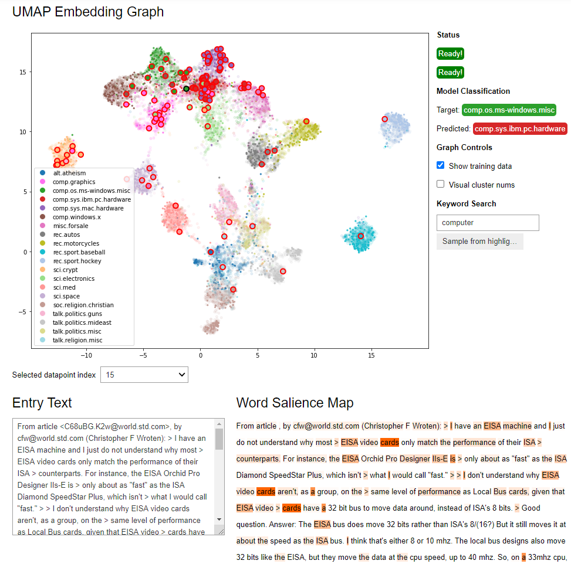

# TX2

[](https://github.com/psf/black)

Welcome to TX2! This library is intended to aid in the explorability and explainability of
transformer classification networks, or transformer language models with sequence classification
heads. The basic function of this library is to take a trained transformer and
test/train dataset and produce an ipywidget dashboard as seen in the screenshot below,
which can be displayed in a jupyter notebook or jupyter lab.



NOTE: Currently this library's implementation is partially torch-dependent, and so will
not work with tensorflow/keras models - we hope to address this limitation in the future!

## Installation

Clone this repo and run:

```bash
pip install ./tx2
```

NOTE: depending on the environment, it may be better to install some of the dependencies separately before
pip installing tx2, e.g. in conda:
```bash
conda install pytorch pandas scikit-learn matplotlib ipywidgets 
```

## Documentation

The documentation can be viewed at [https://ornl.github.io/tx2/](https://ornl.github.io/tx2/).

The documentation can also be built from scratch with sphinx as needed.

Install all required dependencies: 
```bash
pip install -r requirements.txt
```

Build documentation:

```bash
cd docs
make html
```

The `docs/build/html` folder will now contain an `index.html`

Two notebooks demonstrating the dashboard and how to use TX2 are included
in the `examples` folder, highlighting the default and custom approaches
as discussed in the Basic Usage page of the documentation.