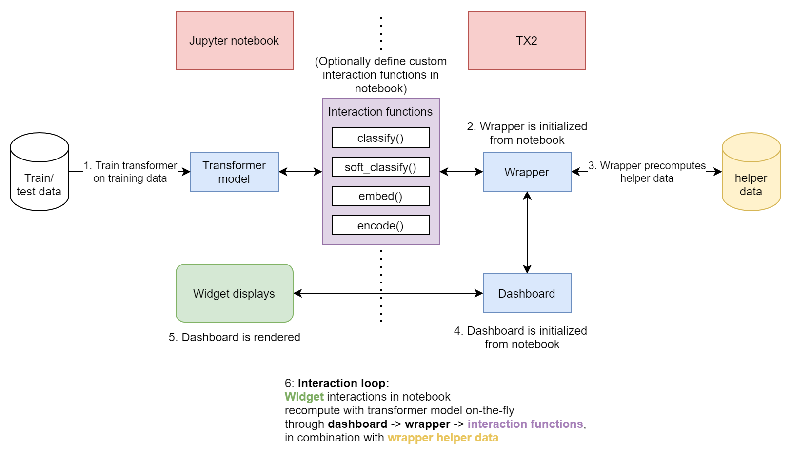
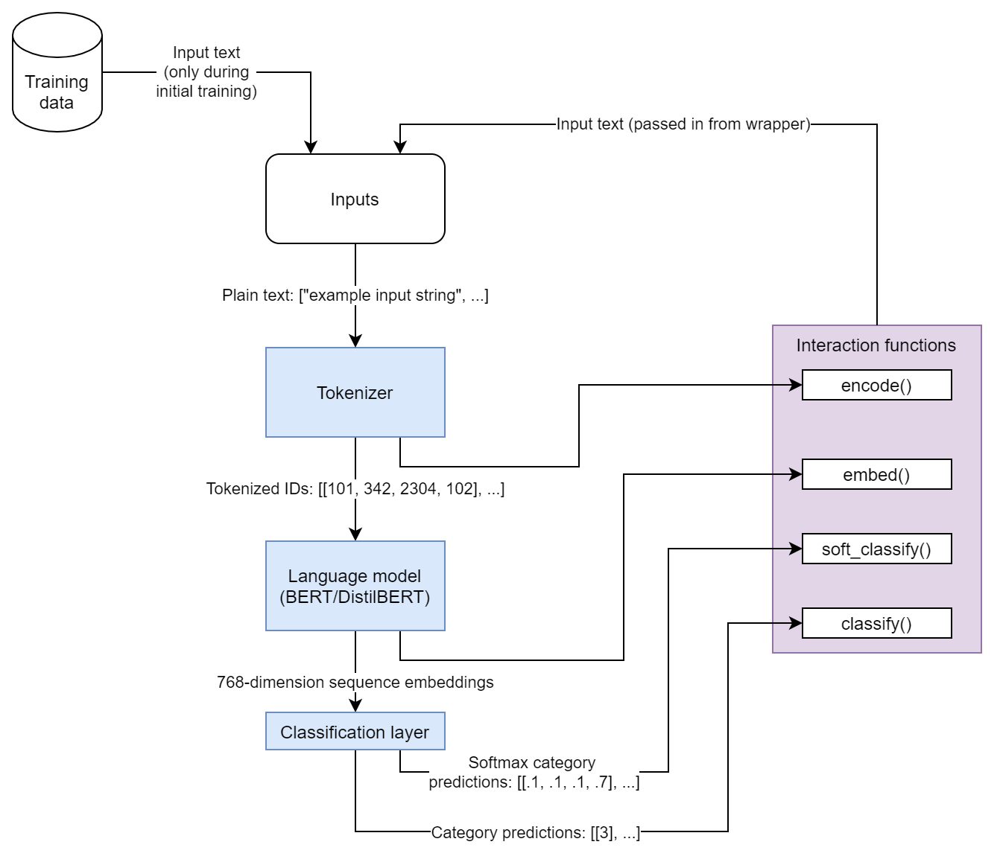

# Summary

The Transformer eXplainability and eXploration [@tx2], or TX$^2$ software package, is a library designed for artificial intelligence researchers to better understand the performance of transformer models [@vaswani2017attention] used for sequence classification. The tool is capable of integrating with a trained transformer model and a dataset split into training and testing populations to produce an ipywidget [@ipywidgets] dashboard with a number of visualizations to understand model performance with an emphasis on explainability and interpretability. The TX$^2$ package is primarily intended to integrate into a workflow centered around Jupyter Notebooks [@jupyternotebook], and currently assumes the use of PyTorch [@pytorch] and Hugging Face transformers library [@hf-transformers]. The dashboard includes visualization and data exploration features to aid researchers, including an interactive UMAP embedding graph [@mcinnes2018umap] to understand classification clusters, a word salience map that can be updated as researchers alter textual entries in near real time, a set of tools to understand word frequency and importance based on the clusters in the UMAP embedding graph, and a set of traditional confusion matrix analysis tools. 

# Statement of Need

Transformers, although particularly effective on a wide variety of natural language processing tasks, have the same challenge of many deep network approaches in that it is difficult to glean insight into why certain classification decisions are made [@aken2020visbert]. Various works have explored the value of analyzing the attention layers in order to provide explainability in the output of a transformer network [@vig2019multiscale]. However, analyzing attention alone can be insufficient when attempting to gain broader insight into why a transformer is performing a certain way with a specific dataset [@jain2019attention]. TX$^2$ aims to address this challenge by providing a model developer with a number of tools to explore why a certain transformer performs in a certain way for a specific dataset. This tool can help a developer determine, among other things, whether or not a specific transformer has gained a generalized understanding of the semantic meaning behind textual entries in a specific dataset. It can also help with studying the impact of language distribution shifts over time on transformer sequence classification performance.

Existing tools, such as Google PAIR's Language Interpretability Tool [@tenney2020lit], also provide a platform to use multiple visualizations to study transformer model performance. TX$^2$ differs from these tools with its emphasis on cluster analysis and easier customization of both the model interaction and dashboard itself within a Jupyter Notebook. The close integration with Jupyter Notebook is advantageous for those researchers who already rely heavily on the tools within the Jupyter ecosystem. Like the Language Interpretability Tool, TX$^2$ offers a projection map with all of the data points; however it goes further in breaking down the visual clusters and providing separate visualizations for understanding the language per cluster. Additionally, the TX$^2$ design promotes easy modification or customization depending on the researcher's needs, as researchers can completely change the presentation order of plots within the ipywidget and even add additional visualizations if desired. 

# Features

The primary visualization for the widget is a UMAP embedding graph that projects the multidimensional sequence embedding space into 2D clusters. This plots multiple controls that can be used to understand how the sequence classifier is working, including the ability to show or hide training data, highlight certain keywords, and focus on misclassifications. Below the UMAP plot, the dashboard includes a set of tools for exploring textual data including a word salience map that shows information on specific train or test data entries. The salience map serves as a proxy for word importance and is computed by recalculating the soft classifications of a particular entry in the corpus multiple times with each word individually removed. The background coloring in the map indicates the degree of impact word removal has on the classification result, with a darker background highlight corresponding to greater importance. The dashboard also includes a text entry box that is prepopulated with the text from the entry shown in the salience map. The user can use this text box to explore the impact of word addition or removal by modifying the entry. The change is reflected both in the salience map plot as well as with a change in the data point in the UMAP embedding graph.  

The dashboard also includes a set of visual clustering analysis tools. Any clustering algorithm from sklearn's [@scikit-learn] clustering module can be used to assign clusters to the data once it is projected into the UMAP embedding. The dashboard displays cluster labels, along with inter-cluster word frequency, and each words’ importance on the classification result. The salience scores for each word are calculated in aggregate for each cluster, again by iterating with the classifier while individual words are removed. There are also some sampling buttons that allow for a data example to be randomly pulled from a specific cluster so that it can be examined by the entry-specific salience map tool. Finally, it is also possible to output traditional confusion matrices as well as various evaluation scores (e.g., f1-score, accuracy, precision) as part of the dashboard.

# Integration

TX$^2$ includes two main classes: a wrapper class and a dashboard class. The wrapper class wraps around the transformer/classification model and acts as an interface between the dashboard and the transformer. The wrapper is in charge of computing and caching all the necessary data for the dashboard visualizations. The dashboard class is responsible for setting up and rendering the widget layout and handling dashboard interactivity. The flow of interactions between the TX$^2$ library and a Jupyter Notebook can be seen in \autoref{fig:interactivity}.

The wrapper communicates with the transformer through a set of four functions as seen in \autoref{fig:integration}. These functions include an embedding function that returns a single sequence of embeddings for each input text, a classification function that returns the predicted output class for each input text, a soft classification function that returns some output value for each class for each input text, and an encoding function that converts the text into model inputs. 

The default implementation for TX$^2$ assumes a huggingface pretrained model. If this use case fits the purposes of the user, they can use the default implementations for these functions. Otherwise, the user will need to redefine the functions to handle their use case while ensuring that the new functions return the necessary data and the correct format.

# Audience

The target audience for the TX$^2$ tool are machine learning or artificial intelligence researchers focused on natural language processing with transformers, and who are comfortable operating within the Jupyter ecosystem for demonstration or exploration. This open-source software is licensed under a BSD-3 clause license, is registered on [DOE Code](https://doi.org/10.11578/dc.20210129.1), and is available on [GitHub](https://github.com/ORNL/tx2). The package is also pip installable with ``pip install tx2`` with Sphinx [@sphinx] built [documentation](https://ornl.github.io/tx2/index.html). Finally, linting for this project is performed using black [@black-linter].

# Acknowledgements

The authors would like to acknowledge the US Department of Energy, National Nuclear Security Administration's Office of Defense Nuclear Nonproliferation Research and Development (NA-22) for supporting this work. 

This manuscript has been authored by UT-Battelle, LLC, under contract DE-AC05-00OR22725 with the US Department of Energy (DOE). The US government retains and the publisher, by accepting the article for publication, acknowledges that the US government retains a nonexclusive, paid-up, irrevocable, worldwide license to publish or reproduce the published form of this manuscript, or allow others to do so, for US government purposes. DOE will provide public access to these results of federally sponsored research in accordance with the DOE Public Access Plan (http://energy.gov/downloads/doe-public-access-plan).

# References
